# Welcome to the Photo Search Implementation App 👋

This project `PhotoResearch` is created with [`create-expo-app`](https://www.npmjs.com/package/create-expo-app) and demonstrates a photo search functionality using Google Cloud Vision API.

## Project Overview

This app allows users to:

- Search for products by text input.

- Upload or take photos to search for products using Google Cloud Vision API.

- Filter products by department.

- Save favorite products to a list.

- View product details including name, price, brand, and rating.

- Add products to the cart. (Not fully implemented)

- Login and Logout. (Not fully implemented)


## Getting Started

### Prerequisites

Make sure you have the following installed:

- Node.js

- npm or yarn

- Expo CLI


### Installation

1. Clone the repository:
   ```bash
   git clone https://matheus_lemos_champion@bitbucket.org/thdca/techcheck-matheus.git
   cd Champion_Matt_PhotoResearch
   ```

2. Install dependencies:
   ```bash
   npm install
   ```

3. Create a `.env` file in the root directory and add your Google Cloud Vision API key:
   ```env
   GOOGLE_CLOUD_VISION_API_KEY=your_api_key_here
   ```

### Running the App

1. Start the app:
   ```bash
   npm start
   ```

2. Use the Expo Go app on your mobile device to scan the QR code and run the app.

## Code Reference

### General

- "Npm: Create-expo-app." Npm, www.npmjs.com/package/create-expo-app. Accessed 7 Feb. 2025.
- "Guides." Expo Documentation, https://docs.expo.dev/guides. Accessed 7 Feb. 2025.
- "Copilot." GitHub, https://github.com/github/copilot. Accessed 7 Feb. 2025.
- "Index." Expo Icons, https://icons.expo.fyi/Index. Accessed 12 Feb. 2025.
- "React Native Responsive Fontsize." npm, https://www.npmjs.com/package/react-native-responsive-fontsize. Accessed 20 Feb. 2025.
- "Axios." npm, 2025, www.npmjs.com/package/axios. Accessed 20 Feb. 2025.

### Specific Files

 **./app/_layout.tsx**:

  - "Tabs." Expo Documentation, https://docs.expo.dev/router/advanced/tabs/. Accessed 7 Feb. 2025.
  - Code With Nomi. “Custom Tab Navigation in Expo Router | React Native Tutorial | Part 1.” YouTube, 5 June 2024, www.youtube.com/watch?v=K6OJP0s5VDQ. Accessed 7 Feb. 2025.

 **./app/shop.tsx**:

  - Bug Ninza. “Integrating Google Cloud Vision API With React Native Expo | Object Detection | Tutorial and Demo.” YouTube, 31 July 2023, www.youtube.com/watch?v=iir0ezSvRLw. Accessed 11 Feb. 2025.
  - "ImagePicker." Expo Documentation, https://docs.expo.dev/versions/latest/sdk/imagepicker/. Accessed 12 Feb. 2025.
  - "Labels." Google Cloud Vision Documentation, https://cloud.google.com/vision/docs/labels. Accessed 12 Feb. 2025.
  - Harder, Anna. "How to Make Star Rating in React." DEV Community, https://dev.to/annaqharder/how-to-make-star-rating-in-react-2e6f. Accessed 17 Feb. 2025.

 **./app/account.tsx**:

  - Rising tide. “Login UI With React Native/Expo.” YouTube, 25 Jan. 2024, www.youtube.com/watch?v=E-yHPWAjhcs.. Accessed 24 Feb. 2025.

 **./context/SavedItemsContext.tsx**:
 
  - "React: How to Update State.item1 in State Using setState." Stack Overflow, https://stackoverflow.com/questions/29537299/react-how-to-update-state-item1-in-state-using-setstate. Accessed 25 Feb. 2025.
  - "createContext." React Documentation, https://react.dev/reference/react/createContext. Accessed 25 Feb. 2025.


## Running Application Demo


**PAGES**


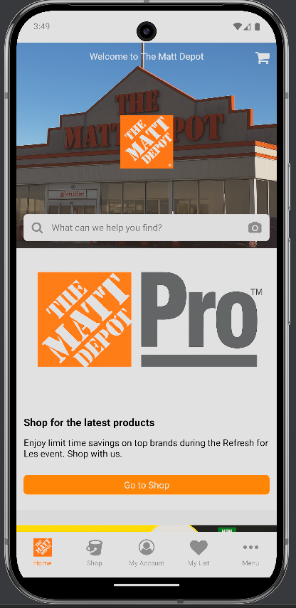
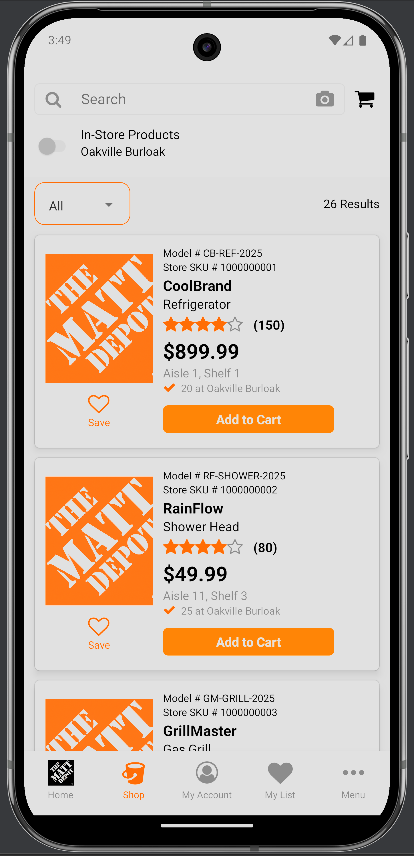
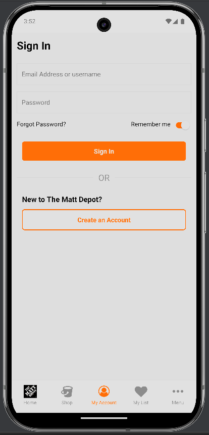
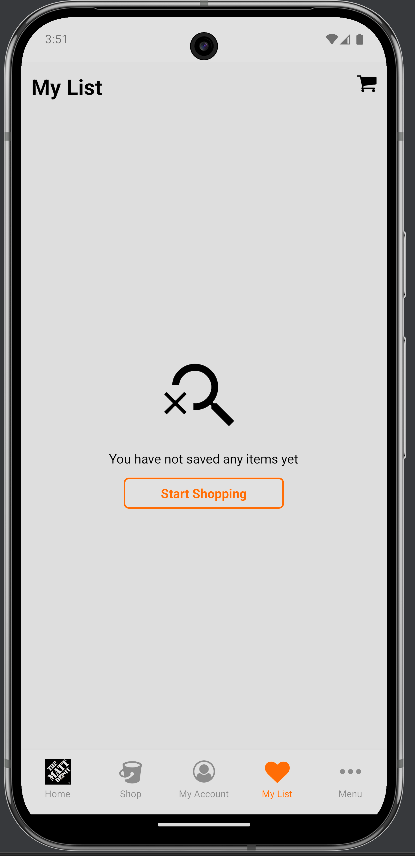
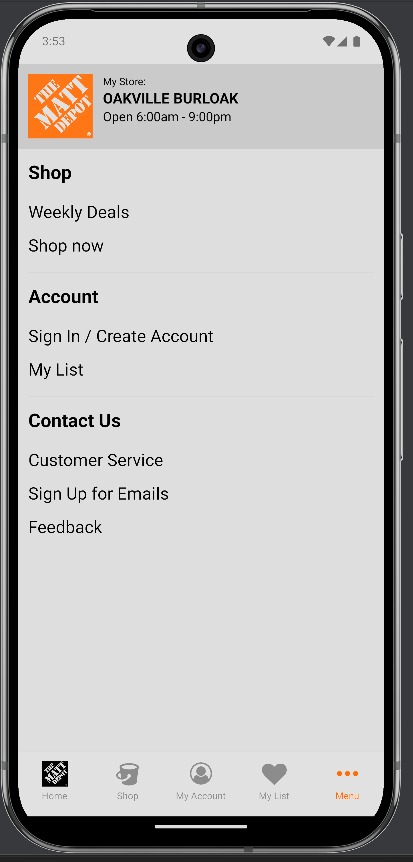


**IMAGE SEARCH**


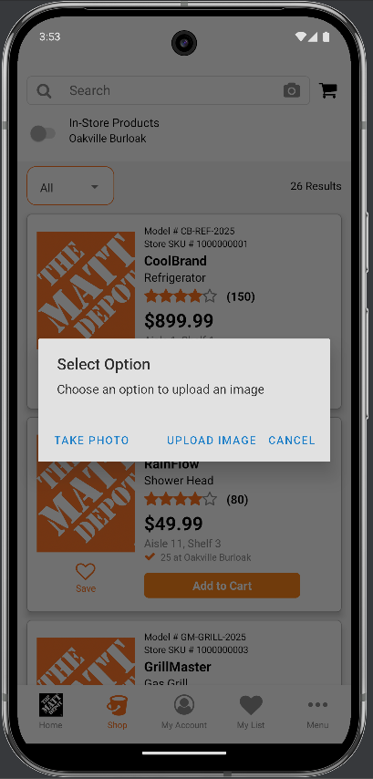
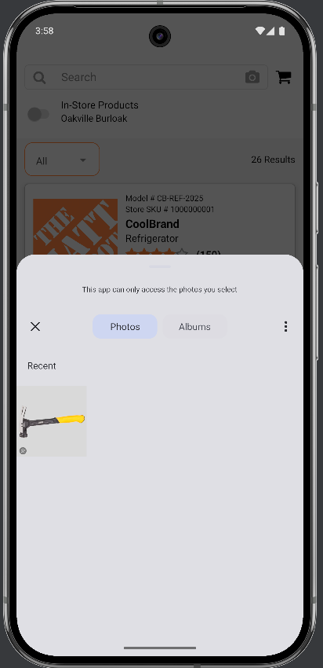
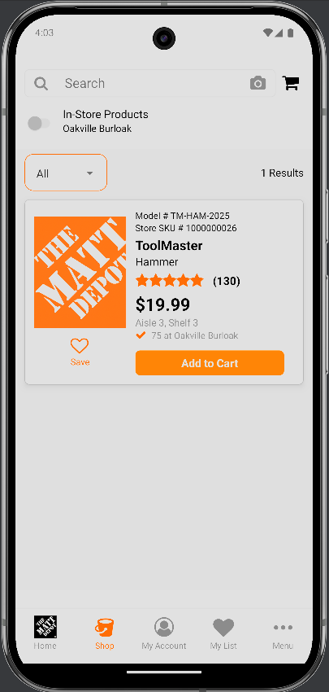


**SEARCH**


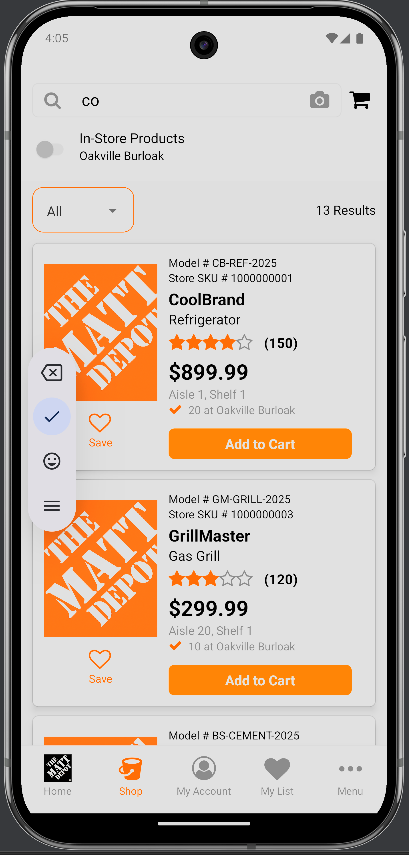


**SAVE/ADD CART**


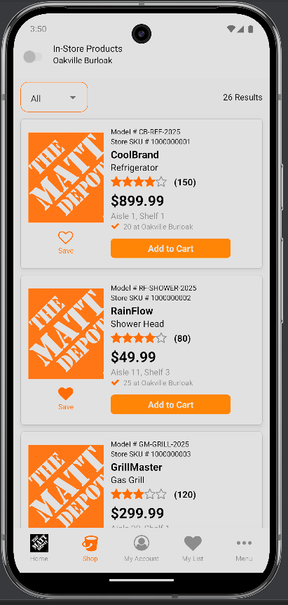
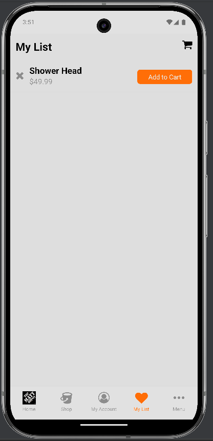
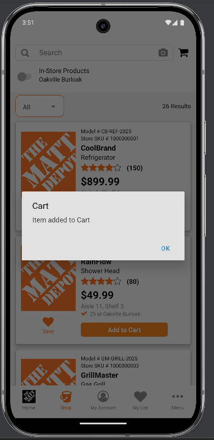


**LOGGED IN**


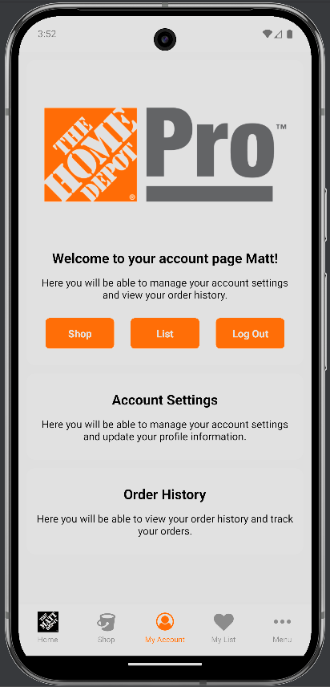


**FILTER**


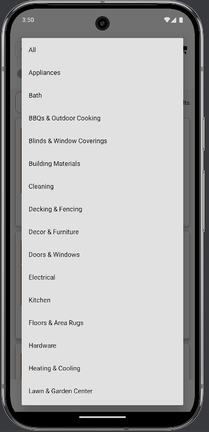


**LOADING LOGO**


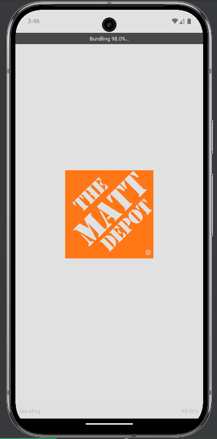